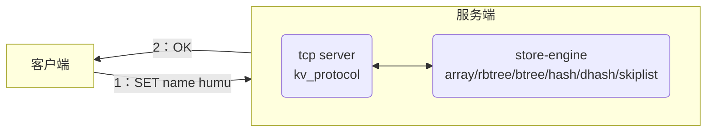

# 使用说明

- “kv-store-v1”：存放全部的项目源码，项目使用C语言完成，代码总量在5000行左右。其中的“code_init”文件夹为前期验证rbtree、btree的增/删/查操作，使用```int```型作为元素类型。

- “Document”：存放项目开发过程中用到的文档或工具。

要运行本项目，需要准备两台Linux机器，“客户端”存放“kv-store-v1”的“tb_kvstore.c”、“服务端”存放“kv-store-v1”中剩余的所有代码（不包括“code_init”文件夹）。编译指令如下：

服务端：

```gcc -o main main.c kvstore.c array.c rbtree.c btree.c hash.c dhash.c skiplist.c```

```./main 9998```

客户端：

```gcc -o tb_kvstore tb_kvstore.c```

```./tb_kvstore 192.168.154.130 9998```

视频讲解参考B站：“[【C语言项目笔记】基于C语言实现内存型数据库(kv存储)](https://www.bilibili.com/video/BV1kC411a7xg/)”

下面是整个项目的说明文档，更舒服的排版可以看看CSDN：“[基于C语言实现内存型数据库(kv存储)](https://blog.csdn.net/weixin_46258766/article/details/136228729)”。

***

# 基于C语言实现内存型数据库(kv存储)

[toc]
> - 源代码仓库见Github：[kv-store仓库](https://github.com/jjejdhhd/kv-store)
> - 参考视频：“零声教育”的“[linux基础架构-Kv存储](https://app0k9osxub4596.h5.xiaoeknow.com/p/decorate/page/eyJpZCI6NDI3OTU2MiwiY2hhbm5lbF9pZCI6IiJ9)”。
> - 其他源码：[协程](https://github.com/wangbojing/NtyCo)。

***


# 1. 项目背景

## 1.1 Redis介绍

&emsp;&emsp;本项目主要想仿照Redis的交互方式，实现一个基本的“**内存型数据库**”，所以首先来介绍一下Redis。随着互联网的普及，只要是上网的APP基本上都需要和相应的服务器请求数据，通常来说，这些数据被服务器保存在“磁盘”上的文件中，称之为“**磁盘型数据库**”。但是面对海量用户时(比如秒杀活动)，磁盘IO的读写速率不够快从而导致用户体验下降，并且服务器数据库的压力也非常大。鉴于很多请求只是读取数据，这就启发我们将一些热点数据存放在内存中，以便快速响应请求、并且减轻磁盘的读写压力。

当然，上述只是一个初步的想法，后续如何清理内存数据、分布式存储等可以参考B站的科普视频，讲的非常简洁易懂：
> - [【趣话Redis第一弹】我是Redis，MySQL大哥被我坑惨了！](https://www.bilibili.com/video/BV1Fd4y1T7pD/)---“缓存穿透、缓存击穿、缓存雪崩”、“定时删除、惰性删除、内存淘汰”
> - [【趣话Redis第二弹】Redis数据持久化AOF和RDB原理一次搞懂！](https://www.bilibili.com/video/BV1sV4y147Jz/)---“RDB+AOF”
> - [【趣话Redis第三弹】Redis的高可用是怎么实现的？哨兵是什么原理？](https://www.bilibili.com/video/BV1MW4y187AH/)---“主观下线、客观下线”、“哨兵选举”、“故障转移”
> - [趣话Redis：Redis集群是如何工作的？](https://www.bilibili.com/video/BV1ge411L7Sh/)---“哈希桶”、“集群工作+主从复制”

下面是一些典型的面试题：
> - 为什么要使用Redis？
> > 1. 从高并发上来说：直接操作缓存能够承受的请求是远远大于直接访问数据库的，所以我们可以考虑把数据库中的部分数据转移到缓存中去。这样用户的一部分请求会直接到缓存，而不用经过数据库。
> > 2. 从高性能上来说：用户第一次访问数据库中的某些数据，因为是从硬盘上读取的，所以这个过程会比较慢。将该用户访问的数据存在缓存中，下一次再访问这些数据的时候就可以直接从缓存中获取了。操作缓存就是直接操作内存，所以速度相当快。
> 
> - 为什么要使用Redis而不是其他的，例如Java自带的map或者guava？
> > &emsp;&emsp;缓存分为本地缓存和分布式缓存，像map或者guava就是本地缓存。本地缓存最主要的特点是轻量以及快速，生命周期随着jvm的销毁而结束。在多实例的情况下，每个实例都需要各自保存一份缓存，缓存不具有一致性。redis或memcached之类的称为分布式缓存，在多实例的情况下，各实例共用一份缓存数据，缓存具有一致性。
> 
> - Redis应用场景有哪些?
> > 1. 缓存热点数据，缓解数据库的压力。
> > 2. 利用Redis原子性的自增操作，可以实现计数器的功能。比如统计用户点赞数、用户访问数等。
> > 3. 分布式锁。在分布式场景下，无法使用单机环境下的锁来对多个节点上的进程进行同步。可以使用Redis自带的SETNX命令实现分布式锁，除此之外，还可以使用官方提供的RedLock分布式锁实现。
> > 4. 简单的消息队列。可以使用Redis自身的发布/订阅模式或者List来实现简单的消息队列，实现异步操作。
> > 5. 限速器。可用于限制某个用户访问某个接口的频率，比如秒杀场景用于防止用户快速点击带来不必要的压力。
> > 6. 好友关系。利用集合的一些命令，比如交集、并集、差集等，实现共同好友、共同爱好之类的功能。
> 
> - 为什么Redis这么快？
> > 1. Redis是基于内存进行数据操作的Redis使用内存存储，没有磁盘IO上的开销，数据存在内存中，读写速度快。
> > 2. 采用IO多路复用技术。Redis使用单线程来轮询描述符，将数据库的操作都转换成了事件，不在网络I/O上浪费过多的时间。
> > 3. 高效的数据结构。Redis每种数据类型底层都做了优化，目的就是为了追求更快的速度。
> 
> - 参考视频：[为什么要使用Redis？](https://www.bilibili.com/video/BV1sS4y1w7Cf/)、[Redis的应用场景有哪些？](https://www.bilibili.com/video/BV1GG4y1H7tK/)、[Redis，好快！](https://www.bilibili.com/video/BV1va411a7pc/)

## 1.2 项目预期及基本架构

<div align=center>


</div><div align=center>
图1 项目框架
</div>


&emsp;&emsp;于是我们现在就来实现这个“内存型数据库”，**本项目使用C语言，默认键值对key-value都是```char*```类型**。如上图所示，我们希望“客户端”可以和“服务端”通讯，发送相应的指令并得到相应的信息。比如“客户端”插入一个新的键值对“(name: humu)”，那么就发送“SET name humu”；“服务端”接收到这个数据包后，执行相应的操作，再返回“OK”给“客户端”。鉴于**kv存储需要强查找的数据结构**，我们可以使用rbtree、btree、b+tree、hash、dhash、array(数据量不多，比如http头)、skiplist、list(性能低不考虑)。最终，下表列出了我们要实现的所有数据结构及其对应的指令：

<div align=center>
表1 kv存储协议对应的数据结构及命令
</div>
<div align=center><table style="border-collapse:collapse;border-spacing:0" class="tg"><thead><tr><th style="border-color:black;border-style:solid;border-width:1px;font-family:Arial, sans-serif;font-size:14px;font-weight:normal;overflow:hidden;padding:10px 5px;text-align:center;vertical-align:middle;word-break:normal">操作/<br>数据结构</th><th style="border-color:black;border-style:solid;border-width:1px;font-family:Arial, sans-serif;font-size:14px;font-weight:bold;overflow:hidden;padding:10px 5px;text-align:center;vertical-align:middle;word-break:normal">插入</th><th style="border-color:black;border-style:solid;border-width:1px;font-family:Arial, sans-serif;font-size:14px;font-weight:bold;overflow:hidden;padding:10px 5px;text-align:center;vertical-align:middle;word-break:normal">查找</th><th style="border-color:black;border-style:solid;border-width:1px;font-family:Arial, sans-serif;font-size:14px;font-weight:bold;overflow:hidden;padding:10px 5px;text-align:center;vertical-align:middle;word-break:normal">删除</th><th style="border-color:black;border-style:solid;border-width:1px;font-family:Arial, sans-serif;font-size:14px;font-weight:bold;overflow:hidden;padding:10px 5px;text-align:center;vertical-align:middle;word-break:normal">计数</th><th style="border-color:black;border-style:solid;border-width:1px;font-family:Arial, sans-serif;font-size:14px;font-weight:bold;overflow:hidden;padding:10px 5px;text-align:center;vertical-align:middle;word-break:normal">存在</th></tr></thead><tbody><tr><td style="border-color:black;border-style:solid;border-width:1px;font-family:Arial, sans-serif;font-size:14px;font-weight:bold;overflow:hidden;padding:10px 5px;text-align:center;vertical-align:middle;word-break:normal">array</td><td style="border-color:black;border-style:solid;border-width:1px;font-family:Arial, sans-serif;font-size:14px;overflow:hidden;padding:10px 5px;text-align:center;vertical-align:middle;word-break:normal">SET key value</td><td style="border-color:black;border-style:solid;border-width:1px;font-family:Arial, sans-serif;font-size:14px;overflow:hidden;padding:10px 5px;text-align:center;vertical-align:middle;word-break:normal">GET key</td><td style="border-color:black;border-style:solid;border-width:1px;font-family:Arial, sans-serif;font-size:14px;overflow:hidden;padding:10px 5px;text-align:center;vertical-align:middle;word-break:normal">DELETE key</td><td style="border-color:black;border-style:solid;border-width:1px;font-family:Arial, sans-serif;font-size:14px;overflow:hidden;padding:10px 5px;text-align:center;vertical-align:middle;word-break:normal">COUNT</td><td style="border-color:black;border-style:solid;border-width:1px;font-family:Arial, sans-serif;font-size:14px;overflow:hidden;padding:10px 5px;text-align:center;vertical-align:middle;word-break:normal">EXIST key</td></tr><tr><td style="border-color:black;border-style:solid;border-width:1px;font-family:Arial, sans-serif;font-size:14px;font-weight:bold;overflow:hidden;padding:10px 5px;text-align:center;vertical-align:middle;word-break:normal">rbtree</td><td style="border-color:black;border-style:solid;border-width:1px;font-family:Arial, sans-serif;font-size:14px;overflow:hidden;padding:10px 5px;text-align:center;vertical-align:middle;word-break:normal">RSET key value</td><td style="border-color:black;border-style:solid;border-width:1px;font-family:Arial, sans-serif;font-size:14px;overflow:hidden;padding:10px 5px;text-align:center;vertical-align:middle;word-break:normal">RGET key</td><td style="border-color:black;border-style:solid;border-width:1px;font-family:Arial, sans-serif;font-size:14px;overflow:hidden;padding:10px 5px;text-align:center;vertical-align:middle;word-break:normal">RDELETE key</td><td style="border-color:black;border-style:solid;border-width:1px;font-family:Arial, sans-serif;font-size:14px;overflow:hidden;padding:10px 5px;text-align:center;vertical-align:middle;word-break:normal">RCOUNT</td><td style="border-color:black;border-style:solid;border-width:1px;font-family:Arial, sans-serif;font-size:14px;overflow:hidden;padding:10px 5px;text-align:center;vertical-align:middle;word-break:normal">REXIST key</td></tr><tr><td style="border-color:black;border-style:solid;border-width:1px;font-family:Arial, sans-serif;font-size:14px;font-weight:bold;overflow:hidden;padding:10px 5px;text-align:center;vertical-align:middle;word-break:normal">btree</td><td style="border-color:black;border-style:solid;border-width:1px;font-family:Arial, sans-serif;font-size:14px;overflow:hidden;padding:10px 5px;text-align:center;vertical-align:middle;word-break:normal">BSET key value</td><td style="border-color:black;border-style:solid;border-width:1px;font-family:Arial, sans-serif;font-size:14px;overflow:hidden;padding:10px 5px;text-align:center;vertical-align:middle;word-break:normal">BGET key</td><td style="border-color:black;border-style:solid;border-width:1px;font-family:Arial, sans-serif;font-size:14px;overflow:hidden;padding:10px 5px;text-align:center;vertical-align:middle;word-break:normal">BDELETE key</td><td style="border-color:black;border-style:solid;border-width:1px;font-family:Arial, sans-serif;font-size:14px;overflow:hidden;padding:10px 5px;text-align:center;vertical-align:middle;word-break:normal">BCOUNT</td><td style="border-color:black;border-style:solid;border-width:1px;font-family:Arial, sans-serif;font-size:14px;overflow:hidden;padding:10px 5px;text-align:center;vertical-align:middle;word-break:normal">BEXIST key</td></tr><tr><td style="border-color:black;border-style:solid;border-width:1px;font-family:Arial, sans-serif;font-size:14px;font-weight:bold;overflow:hidden;padding:10px 5px;text-align:center;vertical-align:middle;word-break:normal">hash</td><td style="border-color:black;border-style:solid;border-width:1px;font-family:Arial, sans-serif;font-size:14px;overflow:hidden;padding:10px 5px;text-align:center;vertical-align:middle;word-break:normal">HSET key value</td><td style="border-color:black;border-style:solid;border-width:1px;font-family:Arial, sans-serif;font-size:14px;overflow:hidden;padding:10px 5px;text-align:center;vertical-align:middle;word-break:normal">HGET key</td><td style="border-color:black;border-style:solid;border-width:1px;font-family:Arial, sans-serif;font-size:14px;overflow:hidden;padding:10px 5px;text-align:center;vertical-align:middle;word-break:normal">HDELETE key</td><td style="border-color:black;border-style:solid;border-width:1px;font-family:Arial, sans-serif;font-size:14px;overflow:hidden;padding:10px 5px;text-align:center;vertical-align:middle;word-break:normal">HCOUNT</td><td style="border-color:black;border-style:solid;border-width:1px;font-family:Arial, sans-serif;font-size:14px;overflow:hidden;padding:10px 5px;text-align:center;vertical-align:middle;word-break:normal">HEXIST key</td></tr><tr><td style="border-color:black;border-style:solid;border-width:1px;font-family:Arial, sans-serif;font-size:14px;font-weight:bold;overflow:hidden;padding:10px 5px;text-align:center;vertical-align:middle;word-break:normal">dhash</td><td style="border-color:black;border-style:solid;border-width:1px;font-family:Arial, sans-serif;font-size:14px;overflow:hidden;padding:10px 5px;text-align:center;vertical-align:middle;word-break:normal">DHSET key value</td><td style="border-color:black;border-style:solid;border-width:1px;font-family:Arial, sans-serif;font-size:14px;overflow:hidden;padding:10px 5px;text-align:center;vertical-align:middle;word-break:normal">DHGET key</td><td style="border-color:black;border-style:solid;border-width:1px;font-family:Arial, sans-serif;font-size:14px;overflow:hidden;padding:10px 5px;text-align:center;vertical-align:middle;word-break:normal">DHDELETE key</td><td style="border-color:black;border-style:solid;border-width:1px;font-family:Arial, sans-serif;font-size:14px;overflow:hidden;padding:10px 5px;text-align:center;vertical-align:middle;word-break:normal">DHCOUNT</td><td style="border-color:black;border-style:solid;border-width:1px;font-family:Arial, sans-serif;font-size:14px;overflow:hidden;padding:10px 5px;text-align:center;vertical-align:middle;word-break:normal">DHEXIST key</td></tr><tr><td style="border-color:black;border-style:solid;border-width:1px;font-family:Arial, sans-serif;font-size:14px;font-weight:bold;overflow:hidden;padding:10px 5px;text-align:center;vertical-align:middle;word-break:normal">skiplist</td><td style="border-color:black;border-style:solid;border-width:1px;font-family:Arial, sans-serif;font-size:14px;overflow:hidden;padding:10px 5px;text-align:center;vertical-align:middle;word-break:normal">ZSET key value</td><td style="border-color:black;border-style:solid;border-width:1px;font-family:Arial, sans-serif;font-size:14px;overflow:hidden;padding:10px 5px;text-align:center;vertical-align:middle;word-break:normal">ZGET key</td><td style="border-color:black;border-style:solid;border-width:1px;font-family:Arial, sans-serif;font-size:14px;overflow:hidden;padding:10px 5px;text-align:center;vertical-align:middle;word-break:normal">ZDELETE key</td><td style="border-color:black;border-style:solid;border-width:1px;font-family:Arial, sans-serif;font-size:14px;overflow:hidden;padding:10px 5px;text-align:center;vertical-align:middle;word-break:normal">ZCOUNT</td><td style="border-color:black;border-style:solid;border-width:1px;font-family:Arial, sans-serif;font-size:14px;overflow:hidden;padding:10px 5px;text-align:center;vertical-align:middle;word-break:normal">ZEXIST key</td></tr><tr><td style="border-color:black;border-style:solid;border-width:1px;font-family:Arial, sans-serif;font-size:14px;overflow:hidden;padding:10px 5px;text-align:center;vertical-align:middle;word-break:normal">备注</td><td style="border-color:black;border-style:solid;border-width:1px;font-family:Arial, sans-serif;font-size:14px;overflow:hidden;padding:10px 5px;text-align:left;vertical-align:middle;word-break:normal">返回OK/Fail，<br>表示插入键值对是否成功</td><td style="border-color:black;border-style:solid;border-width:1px;font-family:Arial, sans-serif;font-size:14px;overflow:hidden;padding:10px 5px;text-align:left;vertical-align:middle;word-break:normal">返回对应的value</td><td style="border-color:black;border-style:solid;border-width:1px;font-family:Arial, sans-serif;font-size:14px;overflow:hidden;padding:10px 5px;text-align:left;vertical-align:middle;word-break:normal">返回OK/Fail，<br>删除对应的键值对</td><td style="border-color:black;border-style:solid;border-width:1px;font-family:Arial, sans-serif;font-size:14px;overflow:hidden;padding:10px 5px;text-align:left;vertical-align:middle;word-break:normal">返回当前数据结构中<br>存储的键值对数量</td><td style="border-color:black;border-style:solid;border-width:1px;font-family:Arial, sans-serif;font-size:14px;overflow:hidden;padding:10px 5px;text-align:left;vertical-align:middle;word-break:normal">返回True/False，<br>判断是否存在对应的键值对</td></tr></tbody></table>
</div>

&emsp;&emsp;进一步，由于网络编程中的“Hello,World!程序”就是实现一个echo，收到什么数据就原封不动的发送回去。所以我们希望在此基础上，**将kv存储写成一个独立的进程，和网络收发相关代码隔离开**，进而提升代码的可维护性。另外在网络协议的选择中，由于我们的键值对设置通常较短只有十几个字符（比如```set key value```），而<u>http协议</u>的协议头就有几十个字符，有效数据占比太低；<u>udp协议</u>只能在底层网卡确认对方收到，但没法在应用层确认，所以不可控；于是我们**网络通信协议选择tcp**。于是对于“服务端”，我们就可以有如下的架构设计：
<div align=center>
<image src="https://img-blog.csdnimg.cn/direct/d3438ab7a1474c8c85bee7bb30aa79bd.jpeg" width=50%>
</div><div align=center>
图2 “服务端”程序架构
</div>

> 1. 网络层：负责收发数据。本项目中都是“字符串”。
> 2. 协议层：将“网络层”传输过来的字符串进行拆解，若为无效指令直接返回相应的提示信息；若为有效指令则传递给“引擎层”进行进一步的处理，根据“引擎层”的处理结果给出相应的返回信息。
> 3. 引擎层：分为6种存储引擎，每种存储引擎都可以进行具体的增、删、查等操作，也就是实现上表给出的5种命令。
> 4. 存储层：注意“内存型数据库”的数据在内存中，但若后续需要“持久化”也会将数据备份到磁盘中。


# 2. 服务端原理及代码框架

## 2.1 网络数据回环的实现

&emsp;&emsp;在使用原生的socket库函数进行网络通信时，会一直阻塞等待客户端的连接/通信请求，这个线程就做不了其他的事情，非常浪费资源。于是“**reactor模式**”应运而生，也被称为“基于事件驱动”，核心点在于：**注册事件、监听事件、处理事件**。也就是说，线程找了一个“秘书”专门负责去监听网络端口是否有“网络通信”的发生，线程就可以去做其他的事情；等到线程想处理“网络通信”的时候一起全部通知给该线程，然后这个“秘书”继续监听。显然，<u>有这样一个“秘书”存在，可以将“网络通信”、“业务处理”分隔开</u>，一个线程可以同时处理多个客户端的请求/通信，也就实现了“**IO多路复用**一个线程”。下面是常见的三种reactor模式：
> 1. reactor单线程模型：只分配一个线程。显然若线程的“业务处理”时间过长，会导致“秘书”积压的事件过多，甚至可能会丢弃一些事件。本模型不适合计算密集型场景，只适合业务处理非常快的场景。
> 2. reactor多线程模型：分配一个主线程和若干子线程。主线程只负责处理“网络通信”，“业务处理”则交给子线程处理。本模式的好处是可以充分利用多核CPU性能，但是带来了线程安全的问题。并且只有一个线程响应“网络通信”，在瞬时高并发的场景下容易成为性能瓶颈。
> 3. 主从reactor多线程模型：在上述多线程模型的基础上，再额外开辟出新的子线程专门负责“与客户端通信”，主线程则只负责“连接请求”。
>
> 参考B站视频：[【Java面试】介绍一下Reactor模式](https://www.bilibili.com/video/BV14G411Q71q/)

下面使用epoll作为“秘书”完成网路数据回环(echo)，也就是“服务端”程序框架的“网络层”：

**main.c**--共356行
```c
/*
 * zv开头的变量是zvnet异步网络库（epoll）。
 * kv开头的变量是kv存储协议解析。
*/
#include<stdio.h>
#include<stdlib.h>
#include<string.h>

#include<errno.h>
#include<unistd.h>
#include<sys/socket.h>
#include<netinet/in.h>
#include<fcntl.h>
#include<sys/epoll.h>

#include"kvstore.h"

/*-------------------------------------------------------*/
/*-----------------------异步网路库-----------------------*/
/*-------------------------------------------------------*/
/*-----------------------函数声明-------------------------*/
#define max_buffer_len      1024    // 读写buffer长度
#define epoll_events_size   1024    // epoll就绪集合大小
#define connblock_size      1024    // 单个连接块存储的连接数量
#define listen_port_count   1       // 监听端口总数

// 有如下参数列表和返回之类型的函数都称为 CALLBACK
// 回调函数，方便在特定epoll事件发生时执行相应的操作
typedef int (*ZV_CALLBACK)(int fd, int events, void *arg);
// 回调函数：建立连接
int accept_cb(int fd, int event, void* arg);
// 回调函数：接收数据
int recv_cb(int clientfd, int event, void* arg);
// 回调函数：发送数据
int send_cb(int clientfd, int event, void* arg);

// 单个连接
typedef struct zv_connect_s{
    // 本连接的客户端fd
    int fd;
    // 本连接的读写buffer
    char rbuffer[max_buffer_len];
    size_t rcount;  // 读buffer的实际大小
    char wbuffer[max_buffer_len];
    size_t wcount;  // 写buffer的实际大小
    size_t next_len;  // 下一次读数据长度（读取多个包会用到）
    // 本连接的回调函数--accept()/recv()/send()
    ZV_CALLBACK cb;
}zv_connect;

// 连接块的头
typedef struct zv_connblock_s{
    struct zv_connect_s *block;  // 指向的当前块，注意大小为 connblock_size
    struct zv_connblock_s *next;  // 指向的下一个连接块的头
}zv_connblock;

// 反应堆结构体
typedef struct zv_reactor_s{
    int epfd;   // epoll文件描述符
    // struct epoll_event events[epoll_events_size];  // 就绪事件集合
    struct zv_connblock_s *blockheader;  // 连接块的第一个头
    int blkcnt;  // 现有的连接块的总数
}zv_reactor;

// reactor初始化
int init_reactor(zv_reactor *reactor);
// reator销毁
void destory_reactor(zv_reactor* reactor);
// 服务端初始化：将端口设置为listen状态
int init_sever(int port);
// 将本地的listenfd添加进epoll
int set_listener(zv_reactor *reactor, int listenfd, ZV_CALLBACK cb);
// 创建一个新的连接块（尾插法）
int zv_create_connblock(zv_reactor* reactor);
// 根据fd从连接块中找到连接所在的位置
// 逻辑：整除找到所在的连接块、取余找到在连接块的位置
zv_connect* zv_connect_idx(zv_reactor* reactor, int fd);
// 运行kv存储协议
int kv_run_while(int argc, char *argv[]);
/*-------------------------------------------------------*/


/*-----------------------函数定义-------------------------*/
// reactor初始化
int init_reactor(zv_reactor *reactor){
    if(reactor == NULL) return -1;
    // 初始化参数
    memset(reactor, 0, sizeof(zv_reactor));
    reactor->epfd = epoll_create(1);
    if(reactor->epfd <= 0){
        printf("init reactor->epfd error: %s\n", strerror(errno));
        return -1;
    }
    // 为链表集合分配内存
    reactor->blockheader = (zv_connblock*)calloc(1, sizeof(zv_connblock));
    if(reactor->blockheader == NULL) return -1;
    reactor->blockheader->next = NULL;
    // 为链表集合中的第一个块分配内存
    reactor->blockheader->block = (zv_connect*)calloc(connblock_size, sizeof(zv_connect));
    if(reactor->blockheader->block == NULL) return -1;
    reactor->blkcnt = 1;
    return 0;
}

// reator销毁
void destory_reactor(zv_reactor* reactor){
    if(reactor){
        close(reactor->epfd);  // 关闭epoll
        zv_connblock* curblk = reactor->blockheader;
        zv_connblock* nextblk = reactor->blockheader;
        do{
            curblk = nextblk;
            nextblk = curblk->next;
            if(curblk->block) free(curblk->block);
            if(curblk) free(curblk);
        }while(nextblk != NULL);
    }
}

// 服务端初始化：将端口设置为listen状态
int init_sever(int port){
    // 创建服务端
    int sockfd = socket(AF_INET, SOCK_STREAM, 0);  // io
    // fcntl(sockfd, F_SETFL, O_NONBLOCK);  // 非阻塞
    // 设置网络地址和端口
    struct sockaddr_in servaddr;
    memset(&servaddr, 0, sizeof(struct sockaddr_in));
    servaddr.sin_family = AF_INET;  // IPv4
    servaddr.sin_addr.s_addr = htonl(INADDR_ANY);  // 0.0.0.0，任何地址都可以连接本服务器
    servaddr.sin_port = htons(port);  // 端口
    // 将套接字绑定到一个具体的本地地址和端口
    if(-1 == bind(sockfd, (struct sockaddr*)&servaddr, sizeof(struct sockaddr))){
        printf("bind failed: %s", strerror(errno));
        return -1;
    }
    // 将端口设置为listen（并不会阻塞程序执行）
    listen(sockfd, 10);  // 等待连接队列的最大长度为10
    printf("listen port: %d, sockfd: %d\n", port, sockfd);
    return sockfd;
}

// 将本地的listenfd添加进epoll
int set_listener(zv_reactor *reactor, int listenfd, ZV_CALLBACK cb){
    if(!reactor || !reactor->blockheader) return -1;
    // 将服务端放进连接块
    reactor->blockheader->block[listenfd].fd = listenfd;
    reactor->blockheader->block[listenfd].cb = cb;  // listenfd的回调函数应该是accept()
    // 将服务端添加进epoll事件
    struct epoll_event ev;
    ev.data.fd = listenfd;
    ev.events = EPOLLIN;
    epoll_ctl(reactor->epfd, EPOLL_CTL_ADD, listenfd, &ev);
    return 0;
}

// 创建一个新的连接块（尾插法）
int zv_create_connblock(zv_reactor* reactor){
    if(!reactor) return -1;
    // 初始化新的连接块
    zv_connblock* newblk = (zv_connblock*)calloc(1, sizeof(zv_connblock));
    if(newblk == NULL) return -1;
    newblk->block = (zv_connect*)calloc(connblock_size, sizeof(zv_connect));
    if(newblk->block == NULL) return -1;
    newblk->next = NULL;
    // 找到最后一个连接块
    zv_connblock* endblk = reactor->blockheader;
    while(endblk->next != NULL){
        endblk = endblk->next;
    }
    // 添加上新的连接块
    endblk->next = newblk;
    reactor->blkcnt++;
    return 0;
}

// 根据fd从连接块中找到连接所在的位置
// 逻辑：整除找到所在的连接块、取余找到在连接块的位置
zv_connect* zv_connect_idx(zv_reactor* reactor, int fd){
    if(!reactor) return NULL;
    // 计算fd应该在的连接块
    int blkidx = fd / connblock_size;
    while(blkidx >= reactor->blkcnt){
        zv_create_connblock(reactor);
        // printf("create a new connblk!\n");
    }
    // 找到这个连接块
    zv_connblock* blk = reactor->blockheader;
    int i = 0;
    while(++i < blkidx){
        blk = blk->next;
    }
    return &blk->block[fd % connblock_size];
}

// 回调函数：建立连接
// fd：服务端监听端口listenfd
// event：没用到，但是回调函数的常用格式
// arg：应该是reactor*
int accept_cb(int fd, int event, void* arg){
    // 与客户端建立连接
    struct sockaddr_in clientaddr;  // 连接到本服务器的客户端信息
    socklen_t len_sockaddr = sizeof(clientaddr);
    int clientfd = accept(fd, (struct sockaddr*)&clientaddr, &len_sockaddr);
    if(clientfd < 0){
        printf("accept() error: %s\n", strerror(errno));
        return -1;
    }
    // 将连接添加进连接块
    zv_reactor* reactor = (zv_reactor*)arg;
    zv_connect* conn = zv_connect_idx(reactor, clientfd);
    conn->fd = clientfd;
    conn->cb = recv_cb;
    conn->next_len = max_buffer_len;
    conn->rcount = 0;
    conn->wcount = 0;
    // 将客户端添加进epoll事件
    struct epoll_event ev;
    ev.data.fd = clientfd;
    ev.events = EPOLLIN;  // 默认水平触发（有数据就触发）
    epoll_ctl(reactor->epfd, EPOLL_CTL_ADD, clientfd, &ev);
    printf("connect success! sockfd:%d, clientfd:%d\n", fd, clientfd);
}

// 回调函数：接收数据
int recv_cb(int clientfd, int event, void* arg){
    zv_reactor* reactor = (zv_reactor*)arg;
    zv_connect* conn = zv_connect_idx(reactor, clientfd);

    int recv_len = recv(clientfd, conn->rbuffer+conn->rcount, conn->next_len, 0);  // 由于当前fd可读所以没有阻塞
    if(recv_len < 0){
        printf("recv() error: %s\n", strerror(errno));
        close(clientfd);
        // return -1;
        exit(0);
    }else if(recv_len == 0){
        // 重置对应的连接块
        conn->fd = -1;
        conn->rcount = 0;
        conn->wcount = 0;
        // 从epoll监听事件中移除
        epoll_ctl(reactor->epfd, EPOLL_CTL_DEL, clientfd, NULL);
        // 关闭连接
        close(clientfd);
        printf("close clientfd:%d\n", clientfd);
    }else if(recv_len > 0){
        conn->rcount += recv_len;
        // conn->next_len = *(short*)conn->rbuffer;  // 从tcp协议头中获取数据长度，假设前两位是长度
        
        // 处理接收到的字符串，并将需要发回的信息存储在缓冲区中
        printf("recv clientfd:%d, len:%d, mess: %s\n", clientfd, recv_len, conn->rbuffer);
        // conn->rcount = kv_protocal(conn->rbuffer, max_buffer_len);

        // 将kv存储的回复消息（rbuffer）拷贝给wbuffer
        // printf("msg:%s len:%ld\n", msg, strlen(msg));
        memset(conn->wbuffer, '\0', max_buffer_len);
        memcpy(conn->wbuffer, conn->rbuffer, conn->rcount);
        conn->wcount = conn->rcount;
        memset(conn->rbuffer, 0, max_buffer_len);
        conn->rcount = 0;

        // 将本连接更改为epoll写事件
        conn->cb = send_cb;
        struct epoll_event ev;
        ev.data.fd = clientfd;
        ev.events = EPOLLOUT;
        epoll_ctl(reactor->epfd, EPOLL_CTL_MOD, clientfd, &ev);
    }
    return 0;
}

// 回调函数：发送数据
int send_cb(int clientfd, int event, void* arg){
    zv_reactor* reactor = (zv_reactor*)arg;
    zv_connect* conn = zv_connect_idx(reactor, clientfd);

    int send_len = send(clientfd, conn->wbuffer, conn->wcount, 0);
     if(send_len < 0){
        printf("send() error: %s\n", strerror(errno));
        close(clientfd);
        return -1;
     }
    memset(conn->wbuffer, 0, conn->next_len);
    conn->wcount -= send_len;

    // 发送完成后将本连接再次更改为读事件
    conn->cb = recv_cb;
    struct epoll_event ev;
    ev.data.fd = clientfd;
    ev.events = EPOLLIN;
    epoll_ctl(reactor->epfd, EPOLL_CTL_MOD, clientfd, &ev);
    return 0;
}


// 运行kv存储协议
int kv_run_while(int argc, char *argv[]){
    // 创建管理连接的反应堆
    // zv_reactor reactor;
    zv_reactor *reactor = (zv_reactor*)malloc(sizeof(zv_reactor));
    init_reactor(reactor);
    // 服务端初始化
    int start_port = atoi(argv[1]);
    for(int i=0; i<listen_port_count; i++){
        int sockfd = init_sever(start_port+i);
        set_listener(reactor, sockfd, accept_cb);  // 将sockfd添加进epoll
    }
    printf("init finish, listening connet...\n");
    // 开始监听事件
    struct epoll_event events[epoll_events_size] = {0};  // 就绪事件集合
    while(1){
        // 等待事件发生
        int nready = epoll_wait(reactor->epfd, events, epoll_events_size, -1);  // -1等待/0不等待/正整数则为等待时长
        if(nready == -1){
            printf("epoll_wait error: %s\n", strerror(errno));
            break;
        }else if(nready == 0){
            continue;
        }else if(nready > 0){
            // printf("process %d epoll events...\n", nready);
            // 处理所有的就绪事件
            int i = 0;
            for(i=0; i<nready; i++){
                int connfd = events[i].data.fd;
                zv_connect* conn = zv_connect_idx(reactor, connfd);

                // 回调函数和下面的的逻辑实现了数据回环
                if(EPOLLIN & events[i].events){
                    conn->cb(connfd, events[i].events, reactor);
                }
                if(EPOLLOUT & events[i].events){
                    conn->cb(connfd, events[i].events, reactor);
                } 
            }
        }
    }
    destory_reactor(reactor);
    return 0;
}

int main(int argc, char *argv[]){
    if(argc != 2){
        printf("please enter port! e.x. 9999.\n");
        return -1;
    }
    // 初始化存储引擎
    // kv_engine_init();

    // 运行kv存储
    kv_run_while(argc, argv);
    
    // 销毁存储引擎
    // kv_engine_desy();
    return 0;
}
/*-------------------------------------------------------*/
```

> 注：只有251行、346行、352行是后续和kv存储有关的接口函数。可以发现“网络层”和“协议层”被很好的隔离开来。

<div align=center>
<image src="https://img-blog.csdnimg.cn/direct/2a3a4fb82636469085dcd5ef6125d9a1.png" width=50%>
</div><div align=center>
图3 验证网络数据回环
</div>

可以看到上述实现了网络数据回环的功能。并且进一步来说，假如客户端使用浏览器对该端口进行访问，那么对接收到的数据包进行http协议拆包，根据其请求的内容返回相应的信息（如html文件），那么就是我们所熟知的“**web服务器**”了。为什么是“烂大街”啊，一代比一代卷是吧:sob:。


## 2.2 array的实现

&emsp;&emsp;现在使用“数组”来存储“键值对节点”。首先我们可以想到的是，直接定义一个长度足够大的数组（如1024），然后每次“插入”就直接找第一个空节点，“查找”和“删除”都是遍历所有节点。但是数组长度固定是一件很危险的事情，所以我们可以借鉴“内存池”的思想，来自动进行扩容和缩容。

<div align=center>
<image src="https://img-blog.csdnimg.cn/direct/ea1f19beaf9f430e9952ec278930f141.jpeg" width=50%>
</div><div align=center>
图4 array结构自动扩容/缩容的示意图
</div>

如上图所示，首先申请一个固定大小的“数组”存储元素，当在某次“插入”元素发现没有空节点时，可以直接再申请一块“数组”，并将当前数组指向这个新数组；同理，当我们“删除”一个元素时，若发现删除后当前数组块为空，可以直接```free```掉这块内存，然后将其前后的内存块连起来。注意到，为了能帮助我们快速判断某个数组块是否为空，还需要在其结构体中定义当前数组块的有效元素数量```count```。

array结构的增/删/查操作还是比较简单的，可以直接参考[项目源码](https://github.com/jjejdhhd/kv-store/tree/main/kv-store-v1)中的“array.h”、“array.c”。

## 2.3 rbtree的实现

<div align=center>
<image src="https://img-blog.csdnimg.cn/direct/d3c0e3f9b05e4c49bb1145bc3d503126.png" width=35%></div><div align=center>
图5 红黑树示意图
</div>

&emsp;&emsp;红黑树是一种“自平衡的二叉搜索树”，可谓是耳熟能详，其增删查改的操作都已经非常成熟。通俗来说，红黑树本质上是一个二叉树，而一个满二叉树的查找性能近似于$O(\log N)$，于是我们便希望每次插入/删除元素时，红黑树都能把自己调整成近乎于满二叉树的状态。具体来说，就是在普通二叉树的基础上，<u>只需要为每个节点额外添加一个“颜色信息”</u>，再额外规定一些必须满足的性质，就可以保证红黑树始终平衡。下面是红黑树的性质--来源中文维基百科“[红黑树](https://zh.wikipedia.org/zh-cn/%E7%BA%A2%E9%BB%91%E6%A0%91)”：
> 1. 每个节点是红的或者黑的。
> 2. 根结点是黑的。
> 3. 所有叶子节点都是黑的（叶子节点是nil节点）。
> 4. 红色节点的子节点必须是黑色。（或者说红色节点不相邻）
> 5. 从任一节点到其每个叶子节点的所有简单路径，都包含相同数目的黑色节点。
>
> “nil节点”：是一个黑色的空节点，作为红黑树的叶子节点。
> 性质口诀：左根右，根叶黑，不红红，黑路同
> 注：零声教育提供了能显示红黑树生成步骤的本地HTML文件--“[红黑树生成步骤.html(39KB)](https://github.com/jjejdhhd/kv-store/tree/main/Document)”。


&emsp;&emsp;红黑树的查找操作只需要从根节点不断比较即可，而红黑树的插入/删除操作则有点说法。下面是我按照编程逻辑进行简化的插入/删除原理。具体来说，就是每次插入/删除后都需要进行调整，调整的逻辑如下：
> **红黑树插入**：刚插入的位置一定是叶子节点，颜色为红，然后按照如下方式调整。
> ```c
> // 父节点是黑色：无需操作。
> while(父节点是红色){
>   if(叔节点为红色){
>       变色：祖父变红/父变黑/叔变黑、祖父节点成新的当前节点。
>       进入下一次循环。
>   }else(叔节点是黑色，注意叶子节点也是黑色){
>       判断“祖父节点->父节点->当前节点”的左右走向：
>           LL：祖父变红/父变黑、祖父右旋。最后的当前节点应该是原来的当前节点。
>           LR：祖父变红/父变红/当前变黑、父左旋/祖父右旋。最后的当前节点应该是原来的祖父节点/父节点。
>           RL：祖父变红/父变红/当前变黑、父右旋/祖父左旋。最后的当前节点应该是原来的祖父节点/父节点。
>           RR：祖父变红/父变黑、祖父左旋。最后的当前节点应该是原来的当前节点。
>       然后进入下一次循环。
>   }
> }
> ```
> 
> **红黑树删除**：要删除的位置一定是 没有/只有一个 孩子。也就是说，如果要删除的元素有两个孩子，那就和其后继节点交换键值对，然后实际删除这个后继节点。实际删除的节点```del_r```为黑色，则将“孩子节点”（没有孩子就是左侧的叶子节点）作为“当前节点”按照如下方式调整。
> ```c
> while(当前节点是黑色 && 不是根节点){
>   if(兄弟节点为红色）{
>       if(当前节点是左孩子)父变红/兄弟变黑、父左旋，当前节点下一循环。
>       else(当前节点是右孩子)父变红/兄弟变黑、父右旋，当前节点下一循环。
>   }
>   else(兄弟节点为黑色){
>       if(兄弟节点没有红色子节点){
>           if(父为黑)父变黑/兄弟变红，父节点成新的当前节点进入下一循环。
>           else(父为红)父变黑/兄弟变红，结束循环（当前节点指向根节点）。
>       }else(兄弟节点有红色子节点){
>           判断“父节点->兄弟节点->兄弟的红色子节点（两个子节点都是红色则默认是左）”的走向：
>               LL：红子变黑/兄弟变父色、父右旋、父变黑，结束循环。
>               LR：红子变父色、兄弟左旋/父右旋、父变黑，结束循环。
>               RR：红子变黑/兄弟变父色、父左旋、父变黑，结束循环。
>               RL：红子变父色、兄弟右旋/父左旋、父变黑，结束循环。
>           “结束循环”等价于当前节点指向根节点。
>       }
>   }
> }
> 注意出了循环别忘了将根节点调整成黑色。
> ```

根据上述原理，我使用C语言实现了红黑树完整的**增删查**操作，并增加了**检验有效性**、**打印红黑树图**的代码，以及**测试代码**。值得注意的是，为了加快开发速度，下面的代码预设“键值对”的类型为```int key```、```void* value```，也就是只关心```int```型的```key```、不关心```value```，后续将红黑树添加进“kv存储协议”中时会进一步修改：

**rbtree_int.c**-共905行：见本仓库“./kv-store-v1/code_init/rbtree_int.c”。

**测试代码输出结果**
```bash
lyl@ubuntu:~/Desktop/kv-store/code_init$ gcc -o main rbtree_int.c 
lyl@ubuntu:~/Desktop/kv-store/code_init$ ./main
-------------------红黑树插入测试------------------
测试数组长度: 18
RAND_MAX: 2147483647
PASS---->插入测试
-------------------红黑树前驱节点测试------------------
PASS---->前驱节点测试
-------------------红黑树后继节点测试------------------
PASS---->后继节点测试
-------------------红黑树删除测试------------------
PASS---->删除测试1
PASS---->删除测试2
PASS---->删除测试3
PASS---->删除测试4
PASS---->删除测试5
PASS---->删除测试6
PASS---->删除测试7
PASS---->删除测试8
PASS---->删除测试9
PASS---->删除测试10
PASS---->删除测试11
PASS---->删除测试12
PASS---->删除测试13
PASS---->删除测试14
PASS---->删除测试15
PASS---->删除测试16
PASS---->删除测试17
PASS---->删除测试18
-------------------红黑树打印测试------------------
PASS---->删除测试18
PASS---->删除测试17
PASS---->删除测试16
                         |  8  |                        
                         |BLACK|                        
              /                           \             
           |  4  |                     |  12 |          
           | RED |                     | RED |          
       /             \             /             \      
    |  2  |       |  6  |       |  10 |       |  14 |   
    |BLACK|       |BLACK|       |BLACK|       |BLACK|   
   /      \      /      \      /      \      /      \   
|  1  ||  3  ||  5  ||  7  ||  9  ||  11 ||  13 ||  15 |
|BLACK||BLACK||BLACK||BLACK||BLACK||BLACK||BLACK||BLACK|
There is NO key=16 in rbtree!
There is NO key=17 in rbtree!
There is NO key=18 in rbtree!
---------------红黑树连续插入性能测试---------------
total INSERTs:1000000  time_used:295(ms)  qps:3389830.50(INSERTs/sec)
---------------红黑树连续查找性能测试---------------
total SEARCHs:1000000  time_used:118(ms)  qps:8474576.00(SEARCHs/sec)
---------------红黑树连续删除性能测试---------------
total DELETEs:1000000  time_used:95(ms)  qps:10526315.00(DELETEs/sec)
--------------------------------------------------
```


> 编程感想：
> 1. 每一次旋转都是一次谋权篡位。
> 2. 双旋的时候，最后的“当前节点”应该是原来的“祖父节点/父节点”，若还保留当前身份，那么会造成错误。

> 红黑树插入：
> - 参考B站：[【neko算法课】红黑树 插入【11期】](https://www.bilibili.com/video/BV1BB4y1X7u3/)
> 
> 红黑树删除：
> - 参考B站：[【neko算法课】红黑树 删除【12期】](https://www.bilibili.com/video/BV1Ce4y1Q76H/)
> - 参考微信图文：[图解：什么是二叉排序树？](https://mp.weixin.qq.com/s/9-M9V12JBl41PiygZUgJ_w)--介绍了标准BST删除操作
> - 参考知乎：[图解：红黑树删除篇（一文读懂）](https://zhuanlan.zhihu.com/p/145006031)--里面的v对应del_r、u对应del_r_child
> 
> 红黑树打印：
> - 参考CSDN：[二叉树生成与打印显示 c语言实现](https://blog.csdn.net/weixin_43512663/article/details/90138105)


## 2.4 btree的实现

<div align=center>
<image src="https://img-blog.csdnimg.cn/direct/c383614eafe94bbc9f14ec8b13e4fd7f.jpeg" width=50%>
</div><div align=center>
图6 6阶B树示意图——依次插入26个英文字母
</div>

&emsp;&emsp;一般来说，B树也是一个自平衡的二叉搜索树。但与红黑树不同的是，B树的节点可以存储多个元素，**$m$阶B树的单个节点，最多有 $m-1$ 个元素、$m$ 个子节点**。并且**B树只有孩子节点、没有父节点**（没有向上的指针）。也就是说，对于插入/删除操作，红黑树可以先从上往下寻找插入位置，再从下往上进行调整；而B树要先从上往下调整完（“分裂、合并/借位”），最后在叶子节点进行插入/删除，而没有从下往上的过程。即**进行插入/删除时，B树从上往下只走一次**。下面给出一个 $m$阶B树应该满足的条件（判断一棵B树是否有效的依据）：
> 1. 每个结点至多拥有$m$颗子树。
> 2. 根结点至少拥有两颗子树。
> 3. 除了根结点以外，其余每个分支结点至少拥有$m/2$棵子树。
> 4. 所有的叶结点都在同一层上。
> 5. 有 $k$ 棵子树的分支结点则存在 $k-1$ 个元素，元素按照递增顺序进行排序。
> 6. 单个节点的元素数量 $n$ 满足 $\text{ceil}(m/2)-1 \le n \le m-1$。
> 
> B树可视化网站：https://www.cs.usfca.edu/~galles/visualization/BTree.html

同样的，B树的查找操作只需要从根节点不断比较即可，而B树的插入/删除逻辑如下：
> **B树插入**：从上往下寻找要插入的叶子节点，过程中要下去的孩子若是满节点，则进行“分裂”。
> - 分裂：取孩子的中间节点（第 $\text{ceil}\frac{m}{2}$ 个）放上来，剩下的元素列变成两个子节点。
> - 新元素必然添加到叶子节点上。
> - 注意：只有根节点分裂会增加层高，其余的不会。
> 
> **B树删除**：从上往下寻找要删除元素的所在节点，过程中看情况进行“合并/借位”。若所在节点不是叶子节点，就将其换到叶子节点中。最后在叶子节点删除元素。
> - 合并：从当前节点下放一个元素，然后该元素对应的两个子节点合并成一个子节点。团结就是力量。
> - 借位：从当前节点下方一个元素到元素较少的孩子，然后从当前元素的另一个孩子节点拉上来一个元素取代位置，注意大小顺序。损有余而补不足。
>
> ```c
> // 遍历到叶子节点
> while(不是叶子节点){
>     // 1. 确定下一节点和其兄弟节点
>     if(当前节点有要删除的元素) 哪边少哪边就是下一节点，当前元素对应的另一边就是兄弟节点。
>     else(当前节点没有要删除的元素) 确定好要去的下一节点后，左右两边谁多谁是兄弟节点。
>     // 2. 看是否需要调整
>     if(下一节点元素少){
>         if(孩子的兄弟节点元素多) 借位，进入下一节点。
>         else(孩子的兄弟节点元素少) 合并，进入合并后的节点。
>     }else if(下一节点元素多 && 当前节点有要删除元素){
>         if(下一节点是删除元素的左节点) 删除元素和其前驱元素换位，进入下一节点。
>         else(下一节点是删除元素的右节点) 删除元素和其后继元素换位，进入下一节点。
>     }else{
>         直接进入下一节点。
>     }
> }
> // 然后在叶子节点删除元素
> ```
> 注：判断孩子节点的元素少的条件是 元素数量$\le \text{ceil}\frac{m}{2}-1$，判断元素多的条件是 元素数量$\ge\text{ceil}\frac{m}{2}$。

根据上述原理，我使用C语言实现了B树完整的**增删查**操作，并增加了**检验有效性**、**打印B树**的代码，以及**测试代码(终端进度条)**。同样为了加快开发速度，预设“键值对”的类型为```int key```、```void* value```，后续将B树添加进“kv存储协议”中时会进一步修改：

**btree_int.c**-共989行：见本仓库“./kv-store-v1/code_init/btree_int.c”。

**测试代码输出结果**----记得测一下连续读、查、删的速度
```bash
lyl@ubuntu:~/Desktop/kv-store/code_init$ gcc -o main btree_int.c 
lyl@ubuntu:~/Desktop/kv-store/code_init$ ./main
---------------------常规测试---------------------
PASS TEST PROCESS: ███████████████████ 100%
PASS----> ALL 100 TEST!
--------------------------------------------------
---------------------性能测试---------------------
total INSERTs:10000000  time_used:2379(ms)  qps:4203447.00(INSERTs/sec)
total SEARCHs:10000000  time_used:1007(ms)  qps:9930486.00(SEARCHs/sec)
total DELETEs:10000000  time_used:18(ms)  qps:555555584.00(DELETEs/sec)
--------------------------------------------------
```

> 未解决bug：最后测试的时候如果加上“删除性能测试”，就不显示进度条了？很奇怪

> 参考内容：
> - B站：[【CS61B汉化】七海讲数据结构-平衡树&B树](https://www.bilibili.com/video/BV1T94y1n76U/)--B树的插入--超可爱的视频
> - 知乎：[从B树中删除一个关键字](https://zhuanlan.zhihu.com/p/581952225)--主要参考了孩子元素多的时候怎么删除
> - B站：[可视化数据结构-B+树](https://www.bilibili.com/video/BV1n7411A7x3/)--插入数据的动画很清晰

## 2.5 hash的实现

<div align=center>
<image src="https://img-blog.csdnimg.cn/direct/6de3f29500294bd185dab9c176161560.jpeg" width=20%>
</div><div align=center>
图7 链式哈希结构示意图——固定长度为6
</div>

&emsp;&emsp;终于度过了本项目所有最难的部分，下面的内容都比较简单。链式哈希的增删查操作简洁明了。链式哈希首先会声明一个固定长度的哈希表（如1024），若需要**插入新元素时**，首先计算哈希值作为索引，若有冲突则直接在当前位置使用“**头插法**”即可。注意以下几点：
> 1. 哈希值计算：对应```int```型，```key % table_size```就可以直接当作哈希值。对于```char*```，则可以```sum(key) % table_size```当作哈希值。当前也有专门的哈希函数，但是由于需要频繁计算哈希值，在简单情况下，就采用上述处理即可。
> 2. 单个索引上的链表没有大小关系。所以**查找/删除时需要遍历这个索引对应的整条链表**。

就不单独写```int```型的代码并测试了，可以直接参考[项目源码](https://github.com/jjejdhhd/kv-store/tree/main/kv-store-v1)中的“hash.h”、“hash.c”。

## 2.6 dhash的实现

<div align=center>
<image src="https://img-blog.csdnimg.cn/direct/fab9393bfd2346ff8f752688f7f781bc.jpeg" width=50%>
</div><div align=center>
图8 动态哈希的插入和删除过程
</div>

&emsp;&emsp;显然上述hash有个很大问题，就是“哈希表的大小”是固定的。如果声明哈希表大小为1024，却要插入10w个元素，那每个所有都会对应一个很长的链表，最坏的情况下和直接遍历一遍没什么区别！这显然失去了哈希的意义，于是在上面的基础上，我们使用“**空间换时间**”，自动增加/缩减哈希表的大小：
> 1. 插入元素时，首先判断是否需要扩容。若当前元素超过哈希表的1/2（可以自定义），则将哈希表翻倍，并将原来的元素重新映射到新的哈希表。**若遇到冲突，则将新元素插入到下一个空节点**。
> 2. 删除元素时，首先判断是否需要缩容。若当前元素小于哈希表的1/4（可以自定义），则将哈希表缩小一半，并将原来的元素重新映射到新的哈希表。若当前节点不是待删除元素，则需要**从当前索引开始遍历完所有节点，才能说哈希表不存在此元素**。

同样，不单独写```int```型的代码测试了，可以直接参考[项目源码](https://github.com/jjejdhhd/kv-store/tree/main/kv-store-v1)中的“dhash.h”、“dhash.c”。


## 2.7 skiplist的实现

<div align=center>
<image src="https://img-blog.csdnimg.cn/direct/7729e063fa9c49b4941c923c2eae5de3.jpeg" width=60%>
</div><div align=center>
图9 理想跳表的结构示意图
</div>

&emsp;&emsp;跳表本质上是一个有序链表。红黑树每次比较都能排除一半的节点，这启发我们，要是每次都能找到链表最中间的节点，不就可以实现$O(\log N)$的查找时间复杂度了嘛。于是如上图所示，我们不妨规定跳表的每个节点都有一组指针，跳表还有一个额外的空节点作为“跳表头”，那么就实现了“每次比较都能排除剩下一半的节点”。但是还有个大问题，那就是上述理想跳表需要插入/删除一个元素时，元素的调整会非常麻烦，甚至还需要遍历整个链表来调整所有节点的指向！

所以在实际应用中，不会直接使用上述理想跳表的结构。而是在每次插入一个新元素时，**按照一定概率计算其高度**。统计学证明，当存放元素足够多的时候，实际跳表性能无限趋近于理想跳表。

<div align=center>
<image src="https://img-blog.csdnimg.cn/direct/bca48fe2ca404d5fa05e3c9f7c429640.png" width=45%>
</div><div align=center>
图10 实际跳表的结构示意图
</div>

同样，代码直接见[项目源码](https://github.com/jjejdhhd/kv-store/tree/main/kv-store-v1)中的“skiplist.h”、“skiplist.c”。

## 2.8 kv存储协议的实现

&emsp;&emsp;如“[1.2节-项目预期及基本架构](#12-项目预期及基本架构)”给出的“服务端程序架构”。现在我们实现了网络收发功能（网络层）、所有存储引擎的增删查改操作（引擎层），还差最后一个“kv存储协议”（协议层）就可以实现完整的服务端程序。“kv存储协议”的主要功能有：
> 1. 初始化/销毁所有的存储引擎。这个直接调用各引擎的初始化/销毁函数即可。
> 2. 拆解网络层接收的数据，若为有效指令则传递给相应的存储引擎函数处理，并根据存储引擎的处理结果返回相应的信息给网络层。

值得注意的是，“引擎层”的接口函数应该统一封装命名，并在各存储引擎中实现，“引擎层”的头文件中也只有这些接口函数暴露给“协议层”。这样保证了“协议层”和“引擎层”的隔离性，即使后续“引擎层”代码需要进行修改，也不会干扰到接口函数的调用、无需修改协议层。整个“服务端”的“网络层”、“协议层”、“引擎层”的函数调用关系如下：

<div align=center>
<image src="https://img-blog.csdnimg.cn/direct/66d1781890d7421a9fe22f54f36c3b69.jpeg" width=95%>
</div><div align=center>
图11 “服务端”函数调用关系
</div>

同样，代码直接见[项目源码](https://github.com/jjejdhhd/kv-store/tree/main/kv-store-v1)中的“kvstore.h”、“kvstore.c”。


# 3. 性能测试

<div align=center>
<image src="https://img-blog.csdnimg.cn/direct/90724bafe08f4e48a8fa334065903f2d.png" width=40%>
</div><div align=center>
图12 使用网络连接助手进行简单的功能验证
</div>

&emsp;&emsp;上述我们将“服务端”的代码实现完毕，并且可以使用“网络连接助手”进行正常的收发数据。如上图所示，依次发送5条指令后都得到预期的回复。但是我们要想测试客户端的极限性能，显然需要写一个“客户端”测试程序。该测试程序目标如下：
> 1. 测试单个键值对(name:humu)能否正常实现所有功能。
> 2. 测试多个键值对能否正常实现所有功能。这一步主要是为了验证各引擎能正常扩容/缩容。
> 3. 测试连续进行10w次插入、查找、删除的总耗时，计算出服务器的相应速度qps。
>
> 注：测试代码直接见项目源码中的“[tb_kvstore.c](https://github.com/jjejdhhd/kv-store/blob/main/kv-store-v1/tb_kvstore.c)”。

如下图所示，开启两个Ubuntu虚拟机，分别运行“服务端”、“客户端”程序，得到如下的测试数据：

<div align=center>
<image src="https://img-blog.csdnimg.cn/direct/c6078415831b4053905d29a8a1fa21aa.png" width=60%>
</div><div align=center>
图13 性能测试结果
</div>

<div align=center>
表2 连续5次的性能测试结果
</div><div align=center>
<table style="border-collapse:collapse;border-spacing:0" class="tg"><thead><tr><th style="border-color:black;border-style:solid;border-width:1px;font-family:Arial, sans-serif;font-size:14px;font-weight:bold;overflow:hidden;padding:10px 5px;text-align:center;vertical-align:middle;word-break:normal" rowspan="2">次数</th><th style="border-color:black;border-style:solid;border-width:1px;font-family:Arial, sans-serif;font-size:14px;font-weight:bold;overflow:hidden;padding:10px 5px;text-align:center;vertical-align:middle;word-break:normal" rowspan="2">操作</th><th style="border-color:black;border-style:solid;border-width:1px;font-family:Arial, sans-serif;font-size:14px;font-weight:bold;overflow:hidden;padding:10px 5px;text-align:center;vertical-align:middle;word-break:normal" colspan="6">qps(trans/s)</th></tr><tr><th style="border-color:black;border-style:solid;border-width:1px;font-family:Arial, sans-serif;font-size:14px;font-weight:bold;overflow:hidden;padding:10px 5px;text-align:center;vertical-align:middle;word-break:normal">array</th><th style="border-color:black;border-style:solid;border-width:1px;font-family:Arial, sans-serif;font-size:14px;font-weight:bold;overflow:hidden;padding:10px 5px;text-align:center;vertical-align:middle;word-break:normal">rbtree</th><th style="border-color:black;border-style:solid;border-width:1px;font-family:Arial, sans-serif;font-size:14px;font-weight:bold;overflow:hidden;padding:10px 5px;text-align:center;vertical-align:middle;word-break:normal">btree</th><th style="border-color:black;border-style:solid;border-width:1px;font-family:Arial, sans-serif;font-size:14px;font-weight:bold;overflow:hidden;padding:10px 5px;text-align:center;vertical-align:middle;word-break:normal">hash</th><th style="border-color:black;border-style:solid;border-width:1px;font-family:Arial, sans-serif;font-size:14px;font-weight:bold;overflow:hidden;padding:10px 5px;text-align:center;vertical-align:middle;word-break:normal">dhash</th><th style="border-color:black;border-style:solid;border-width:1px;font-family:Arial, sans-serif;font-size:14px;font-weight:bold;overflow:hidden;padding:10px 5px;text-align:center;vertical-align:middle;word-break:normal">skiplist</th></tr></thead><tbody><tr><td style="border-color:black;border-style:solid;border-width:1px;font-family:Arial, sans-serif;font-size:14px;overflow:hidden;padding:10px 5px;text-align:center;vertical-align:middle;word-break:normal" rowspan="3">1</td><td style="border-color:black;border-style:solid;border-width:1px;font-family:Arial, sans-serif;font-size:14px;overflow:hidden;padding:10px 5px;text-align:center;vertical-align:middle;word-break:normal">插入</td><td style="border-color:black;border-style:solid;border-width:1px;font-family:Arial, sans-serif;font-size:14px;overflow:hidden;padding:10px 5px;text-align:center;vertical-align:middle;word-break:normal">1461.33 </td><td style="border-color:black;border-style:solid;border-width:1px;font-family:Arial, sans-serif;font-size:14px;overflow:hidden;padding:10px 5px;text-align:center;vertical-align:middle;word-break:normal">1918.24 </td><td style="border-color:black;border-style:solid;border-width:1px;font-family:Arial, sans-serif;font-size:14px;overflow:hidden;padding:10px 5px;text-align:center;vertical-align:middle;word-break:normal">1981.65 </td><td style="border-color:black;border-style:solid;border-width:1px;font-family:Arial, sans-serif;font-size:14px;overflow:hidden;padding:10px 5px;text-align:center;vertical-align:middle;word-break:normal">1727.24 </td><td style="border-color:black;border-style:solid;border-width:1px;font-family:Arial, sans-serif;font-size:14px;overflow:hidden;padding:10px 5px;text-align:center;vertical-align:middle;word-break:normal">1924.93 </td><td style="border-color:black;border-style:solid;border-width:1px;font-family:Arial, sans-serif;font-size:14px;overflow:hidden;padding:10px 5px;text-align:center;vertical-align:middle;word-break:normal">1778.44 </td></tr><tr><td style="border-color:black;border-style:solid;border-width:1px;font-family:Arial, sans-serif;font-size:14px;overflow:hidden;padding:10px 5px;text-align:center;vertical-align:middle;word-break:normal">查找</td><td style="border-color:black;border-style:solid;border-width:1px;font-family:Arial, sans-serif;font-size:14px;overflow:hidden;padding:10px 5px;text-align:center;vertical-align:middle;word-break:normal">1604.18 </td><td style="border-color:black;border-style:solid;border-width:1px;font-family:Arial, sans-serif;font-size:14px;overflow:hidden;padding:10px 5px;text-align:center;vertical-align:middle;word-break:normal">1906.07 </td><td style="border-color:black;border-style:solid;border-width:1px;font-family:Arial, sans-serif;font-size:14px;overflow:hidden;padding:10px 5px;text-align:center;vertical-align:middle;word-break:normal">1895.09 </td><td style="border-color:black;border-style:solid;border-width:1px;font-family:Arial, sans-serif;font-size:14px;overflow:hidden;padding:10px 5px;text-align:center;vertical-align:middle;word-break:normal">1741.52 </td><td style="border-color:black;border-style:solid;border-width:1px;font-family:Arial, sans-serif;font-size:14px;overflow:hidden;padding:10px 5px;text-align:center;vertical-align:middle;word-break:normal">1887.68 </td><td style="border-color:black;border-style:solid;border-width:1px;font-family:Arial, sans-serif;font-size:14px;overflow:hidden;padding:10px 5px;text-align:center;vertical-align:middle;word-break:normal">1755.71 </td></tr><tr><td style="border-color:black;border-style:solid;border-width:1px;font-family:Arial, sans-serif;font-size:14px;overflow:hidden;padding:10px 5px;text-align:center;vertical-align:middle;word-break:normal">删除</td><td style="border-color:black;border-style:solid;border-width:1px;font-family:Arial, sans-serif;font-size:14px;overflow:hidden;padding:10px 5px;text-align:center;vertical-align:middle;word-break:normal">1722.71 </td><td style="border-color:black;border-style:solid;border-width:1px;font-family:Arial, sans-serif;font-size:14px;overflow:hidden;padding:10px 5px;text-align:center;vertical-align:middle;word-break:normal">1959.13 </td><td style="border-color:black;border-style:solid;border-width:1px;font-family:Arial, sans-serif;font-size:14px;overflow:hidden;padding:10px 5px;text-align:center;vertical-align:middle;word-break:normal">1909.60 </td><td style="border-color:black;border-style:solid;border-width:1px;font-family:Arial, sans-serif;font-size:14px;overflow:hidden;padding:10px 5px;text-align:center;vertical-align:middle;word-break:normal">1713.88 </td><td style="border-color:black;border-style:solid;border-width:1px;font-family:Arial, sans-serif;font-size:14px;overflow:hidden;padding:10px 5px;text-align:center;vertical-align:middle;word-break:normal">1964.98 </td><td style="border-color:black;border-style:solid;border-width:1px;font-family:Arial, sans-serif;font-size:14px;overflow:hidden;padding:10px 5px;text-align:center;vertical-align:middle;word-break:normal">1887.65 </td></tr><tr><td style="background-color:#B5C6EA;border-color:black;border-style:solid;border-width:1px;font-family:Arial, sans-serif;font-size:14px;overflow:hidden;padding:10px 5px;text-align:center;vertical-align:middle;word-break:normal" rowspan="3">2</td><td style="background-color:#B5C6EA;border-color:black;border-style:solid;border-width:1px;font-family:Arial, sans-serif;font-size:14px;overflow:hidden;padding:10px 5px;text-align:center;vertical-align:middle;word-break:normal">插入</td><td style="background-color:#B5C6EA;border-color:black;border-style:solid;border-width:1px;font-family:Arial, sans-serif;font-size:14px;overflow:hidden;padding:10px 5px;text-align:center;vertical-align:middle;word-break:normal">1570.13 </td><td style="background-color:#B5C6EA;border-color:black;border-style:solid;border-width:1px;font-family:Arial, sans-serif;font-size:14px;overflow:hidden;padding:10px 5px;text-align:center;vertical-align:middle;word-break:normal">1972.93 </td><td style="background-color:#B5C6EA;border-color:black;border-style:solid;border-width:1px;font-family:Arial, sans-serif;font-size:14px;overflow:hidden;padding:10px 5px;text-align:center;vertical-align:middle;word-break:normal">1949.62 </td><td style="background-color:#B5C6EA;border-color:black;border-style:solid;border-width:1px;font-family:Arial, sans-serif;font-size:14px;overflow:hidden;padding:10px 5px;text-align:center;vertical-align:middle;word-break:normal">1710.54 </td><td style="background-color:#B5C6EA;border-color:black;border-style:solid;border-width:1px;font-family:Arial, sans-serif;font-size:14px;overflow:hidden;padding:10px 5px;text-align:center;vertical-align:middle;word-break:normal">1926.63 </td><td style="background-color:#B5C6EA;border-color:black;border-style:solid;border-width:1px;font-family:Arial, sans-serif;font-size:14px;overflow:hidden;padding:10px 5px;text-align:center;vertical-align:middle;word-break:normal">1780.18 </td></tr><tr><td style="background-color:#B5C6EA;border-color:black;border-style:solid;border-width:1px;font-family:Arial, sans-serif;font-size:14px;overflow:hidden;padding:10px 5px;text-align:center;vertical-align:middle;word-break:normal">查找</td><td style="background-color:#B5C6EA;border-color:black;border-style:solid;border-width:1px;font-family:Arial, sans-serif;font-size:14px;overflow:hidden;padding:10px 5px;text-align:center;vertical-align:middle;word-break:normal">1707.30 </td><td style="background-color:#B5C6EA;border-color:black;border-style:solid;border-width:1px;font-family:Arial, sans-serif;font-size:14px;overflow:hidden;padding:10px 5px;text-align:center;vertical-align:middle;word-break:normal">1970.40 </td><td style="background-color:#B5C6EA;border-color:black;border-style:solid;border-width:1px;font-family:Arial, sans-serif;font-size:14px;overflow:hidden;padding:10px 5px;text-align:center;vertical-align:middle;word-break:normal">1883.49 </td><td style="background-color:#B5C6EA;border-color:black;border-style:solid;border-width:1px;font-family:Arial, sans-serif;font-size:14px;overflow:hidden;padding:10px 5px;text-align:center;vertical-align:middle;word-break:normal">1709.46 </td><td style="background-color:#B5C6EA;border-color:black;border-style:solid;border-width:1px;font-family:Arial, sans-serif;font-size:14px;overflow:hidden;padding:10px 5px;text-align:center;vertical-align:middle;word-break:normal">2021.55 </td><td style="background-color:#B5C6EA;border-color:black;border-style:solid;border-width:1px;font-family:Arial, sans-serif;font-size:14px;overflow:hidden;padding:10px 5px;text-align:center;vertical-align:middle;word-break:normal">1747.89 </td></tr><tr><td style="background-color:#B5C6EA;border-color:black;border-style:solid;border-width:1px;font-family:Arial, sans-serif;font-size:14px;overflow:hidden;padding:10px 5px;text-align:center;vertical-align:middle;word-break:normal">删除</td><td style="background-color:#B5C6EA;border-color:black;border-style:solid;border-width:1px;font-family:Arial, sans-serif;font-size:14px;overflow:hidden;padding:10px 5px;text-align:center;vertical-align:middle;word-break:normal">1739.92 </td><td style="background-color:#B5C6EA;border-color:black;border-style:solid;border-width:1px;font-family:Arial, sans-serif;font-size:14px;overflow:hidden;padding:10px 5px;text-align:center;vertical-align:middle;word-break:normal">1918.80 </td><td style="background-color:#B5C6EA;border-color:black;border-style:solid;border-width:1px;font-family:Arial, sans-serif;font-size:14px;overflow:hidden;padding:10px 5px;text-align:center;vertical-align:middle;word-break:normal">1922.82 </td><td style="background-color:#B5C6EA;border-color:black;border-style:solid;border-width:1px;font-family:Arial, sans-serif;font-size:14px;overflow:hidden;padding:10px 5px;text-align:center;vertical-align:middle;word-break:normal">1730.28 </td><td style="background-color:#B5C6EA;border-color:black;border-style:solid;border-width:1px;font-family:Arial, sans-serif;font-size:14px;overflow:hidden;padding:10px 5px;text-align:center;vertical-align:middle;word-break:normal">1917.32 </td><td style="background-color:#B5C6EA;border-color:black;border-style:solid;border-width:1px;font-family:Arial, sans-serif;font-size:14px;overflow:hidden;padding:10px 5px;text-align:center;vertical-align:middle;word-break:normal">1912.74 </td></tr><tr><td style="border-color:black;border-style:solid;border-width:1px;font-family:Arial, sans-serif;font-size:14px;overflow:hidden;padding:10px 5px;text-align:center;vertical-align:middle;word-break:normal" rowspan="3">3</td><td style="border-color:black;border-style:solid;border-width:1px;font-family:Arial, sans-serif;font-size:14px;overflow:hidden;padding:10px 5px;text-align:center;vertical-align:middle;word-break:normal">插入</td><td style="border-color:black;border-style:solid;border-width:1px;font-family:Arial, sans-serif;font-size:14px;overflow:hidden;padding:10px 5px;text-align:center;vertical-align:middle;word-break:normal">1103.35 </td><td style="border-color:black;border-style:solid;border-width:1px;font-family:Arial, sans-serif;font-size:14px;overflow:hidden;padding:10px 5px;text-align:center;vertical-align:middle;word-break:normal">1898.25 </td><td style="border-color:black;border-style:solid;border-width:1px;font-family:Arial, sans-serif;font-size:14px;overflow:hidden;padding:10px 5px;text-align:center;vertical-align:middle;word-break:normal">1923.71 </td><td style="border-color:black;border-style:solid;border-width:1px;font-family:Arial, sans-serif;font-size:14px;overflow:hidden;padding:10px 5px;text-align:center;vertical-align:middle;word-break:normal">1737.59 </td><td style="border-color:black;border-style:solid;border-width:1px;font-family:Arial, sans-serif;font-size:14px;overflow:hidden;padding:10px 5px;text-align:center;vertical-align:middle;word-break:normal">1948.86 </td><td style="border-color:black;border-style:solid;border-width:1px;font-family:Arial, sans-serif;font-size:14px;overflow:hidden;padding:10px 5px;text-align:center;vertical-align:middle;word-break:normal">1794.24 </td></tr><tr><td style="border-color:black;border-style:solid;border-width:1px;font-family:Arial, sans-serif;font-size:14px;overflow:hidden;padding:10px 5px;text-align:center;vertical-align:middle;word-break:normal">查找</td><td style="border-color:black;border-style:solid;border-width:1px;font-family:Arial, sans-serif;font-size:14px;overflow:hidden;padding:10px 5px;text-align:center;vertical-align:middle;word-break:normal">1316.59 </td><td style="border-color:black;border-style:solid;border-width:1px;font-family:Arial, sans-serif;font-size:14px;overflow:hidden;padding:10px 5px;text-align:center;vertical-align:middle;word-break:normal">1867.80 </td><td style="border-color:black;border-style:solid;border-width:1px;font-family:Arial, sans-serif;font-size:14px;overflow:hidden;padding:10px 5px;text-align:center;vertical-align:middle;word-break:normal">1933.38 </td><td style="border-color:black;border-style:solid;border-width:1px;font-family:Arial, sans-serif;font-size:14px;overflow:hidden;padding:10px 5px;text-align:center;vertical-align:middle;word-break:normal">1733.31 </td><td style="border-color:black;border-style:solid;border-width:1px;font-family:Arial, sans-serif;font-size:14px;overflow:hidden;padding:10px 5px;text-align:center;vertical-align:middle;word-break:normal">1953.74 </td><td style="border-color:black;border-style:solid;border-width:1px;font-family:Arial, sans-serif;font-size:14px;overflow:hidden;padding:10px 5px;text-align:center;vertical-align:middle;word-break:normal">1768.44 </td></tr><tr><td style="border-color:black;border-style:solid;border-width:1px;font-family:Arial, sans-serif;font-size:14px;overflow:hidden;padding:10px 5px;text-align:center;vertical-align:middle;word-break:normal">删除</td><td style="border-color:black;border-style:solid;border-width:1px;font-family:Arial, sans-serif;font-size:14px;overflow:hidden;padding:10px 5px;text-align:center;vertical-align:middle;word-break:normal">1774.78 </td><td style="border-color:black;border-style:solid;border-width:1px;font-family:Arial, sans-serif;font-size:14px;overflow:hidden;padding:10px 5px;text-align:center;vertical-align:middle;word-break:normal">1873.89 </td><td style="border-color:black;border-style:solid;border-width:1px;font-family:Arial, sans-serif;font-size:14px;overflow:hidden;padding:10px 5px;text-align:center;vertical-align:middle;word-break:normal">1978.98 </td><td style="border-color:black;border-style:solid;border-width:1px;font-family:Arial, sans-serif;font-size:14px;overflow:hidden;padding:10px 5px;text-align:center;vertical-align:middle;word-break:normal">1771.73 </td><td style="border-color:black;border-style:solid;border-width:1px;font-family:Arial, sans-serif;font-size:14px;overflow:hidden;padding:10px 5px;text-align:center;vertical-align:middle;word-break:normal">1966.76 </td><td style="border-color:black;border-style:solid;border-width:1px;font-family:Arial, sans-serif;font-size:14px;overflow:hidden;padding:10px 5px;text-align:center;vertical-align:middle;word-break:normal">1933.19 </td></tr><tr><td style="background-color:#B5C6EA;border-color:black;border-style:solid;border-width:1px;font-family:Arial, sans-serif;font-size:14px;overflow:hidden;padding:10px 5px;text-align:center;vertical-align:middle;word-break:normal" rowspan="3">4</td><td style="background-color:#B5C6EA;border-color:black;border-style:solid;border-width:1px;font-family:Arial, sans-serif;font-size:14px;overflow:hidden;padding:10px 5px;text-align:center;vertical-align:middle;word-break:normal">插入</td><td style="background-color:#B5C6EA;border-color:black;border-style:solid;border-width:1px;font-family:Arial, sans-serif;font-size:14px;overflow:hidden;padding:10px 5px;text-align:center;vertical-align:middle;word-break:normal">1134.22 </td><td style="background-color:#B5C6EA;border-color:black;border-style:solid;border-width:1px;font-family:Arial, sans-serif;font-size:14px;overflow:hidden;padding:10px 5px;text-align:center;vertical-align:middle;word-break:normal">1887.79 </td><td style="background-color:#B5C6EA;border-color:black;border-style:solid;border-width:1px;font-family:Arial, sans-serif;font-size:14px;overflow:hidden;padding:10px 5px;text-align:center;vertical-align:middle;word-break:normal">1888.72 </td><td style="background-color:#B5C6EA;border-color:black;border-style:solid;border-width:1px;font-family:Arial, sans-serif;font-size:14px;overflow:hidden;padding:10px 5px;text-align:center;vertical-align:middle;word-break:normal">1734.21 </td><td style="background-color:#B5C6EA;border-color:black;border-style:solid;border-width:1px;font-family:Arial, sans-serif;font-size:14px;overflow:hidden;padding:10px 5px;text-align:center;vertical-align:middle;word-break:normal">1909.53 </td><td style="background-color:#B5C6EA;border-color:black;border-style:solid;border-width:1px;font-family:Arial, sans-serif;font-size:14px;overflow:hidden;padding:10px 5px;text-align:center;vertical-align:middle;word-break:normal">1802.00 </td></tr><tr><td style="background-color:#B5C6EA;border-color:black;border-style:solid;border-width:1px;font-family:Arial, sans-serif;font-size:14px;overflow:hidden;padding:10px 5px;text-align:center;vertical-align:middle;word-break:normal">查找</td><td style="background-color:#B5C6EA;border-color:black;border-style:solid;border-width:1px;font-family:Arial, sans-serif;font-size:14px;overflow:hidden;padding:10px 5px;text-align:center;vertical-align:middle;word-break:normal">1394.54 </td><td style="background-color:#B5C6EA;border-color:black;border-style:solid;border-width:1px;font-family:Arial, sans-serif;font-size:14px;overflow:hidden;padding:10px 5px;text-align:center;vertical-align:middle;word-break:normal">1908.80 </td><td style="background-color:#B5C6EA;border-color:black;border-style:solid;border-width:1px;font-family:Arial, sans-serif;font-size:14px;overflow:hidden;padding:10px 5px;text-align:center;vertical-align:middle;word-break:normal">1910.40 </td><td style="background-color:#B5C6EA;border-color:black;border-style:solid;border-width:1px;font-family:Arial, sans-serif;font-size:14px;overflow:hidden;padding:10px 5px;text-align:center;vertical-align:middle;word-break:normal">1726.43 </td><td style="background-color:#B5C6EA;border-color:black;border-style:solid;border-width:1px;font-family:Arial, sans-serif;font-size:14px;overflow:hidden;padding:10px 5px;text-align:center;vertical-align:middle;word-break:normal">1932.37 </td><td style="background-color:#B5C6EA;border-color:black;border-style:solid;border-width:1px;font-family:Arial, sans-serif;font-size:14px;overflow:hidden;padding:10px 5px;text-align:center;vertical-align:middle;word-break:normal">1764.76 </td></tr><tr><td style="background-color:#B5C6EA;border-color:black;border-style:solid;border-width:1px;font-family:Arial, sans-serif;font-size:14px;overflow:hidden;padding:10px 5px;text-align:center;vertical-align:middle;word-break:normal">删除</td><td style="background-color:#B5C6EA;border-color:black;border-style:solid;border-width:1px;font-family:Arial, sans-serif;font-size:14px;overflow:hidden;padding:10px 5px;text-align:center;vertical-align:middle;word-break:normal">1778.54 </td><td style="background-color:#B5C6EA;border-color:black;border-style:solid;border-width:1px;font-family:Arial, sans-serif;font-size:14px;overflow:hidden;padding:10px 5px;text-align:center;vertical-align:middle;word-break:normal">1897.97 </td><td style="background-color:#B5C6EA;border-color:black;border-style:solid;border-width:1px;font-family:Arial, sans-serif;font-size:14px;overflow:hidden;padding:10px 5px;text-align:center;vertical-align:middle;word-break:normal">1937.98 </td><td style="background-color:#B5C6EA;border-color:black;border-style:solid;border-width:1px;font-family:Arial, sans-serif;font-size:14px;overflow:hidden;padding:10px 5px;text-align:center;vertical-align:middle;word-break:normal">1719.25 </td><td style="background-color:#B5C6EA;border-color:black;border-style:solid;border-width:1px;font-family:Arial, sans-serif;font-size:14px;overflow:hidden;padding:10px 5px;text-align:center;vertical-align:middle;word-break:normal">1935.40 </td><td style="background-color:#B5C6EA;border-color:black;border-style:solid;border-width:1px;font-family:Arial, sans-serif;font-size:14px;overflow:hidden;padding:10px 5px;text-align:center;vertical-align:middle;word-break:normal">1928.57 </td></tr><tr><td style="border-color:black;border-style:solid;border-width:1px;font-family:Arial, sans-serif;font-size:14px;overflow:hidden;padding:10px 5px;text-align:center;vertical-align:middle;word-break:normal" rowspan="3">5</td><td style="border-color:black;border-style:solid;border-width:1px;font-family:Arial, sans-serif;font-size:14px;overflow:hidden;padding:10px 5px;text-align:center;vertical-align:middle;word-break:normal">插入</td><td style="border-color:black;border-style:solid;border-width:1px;font-family:Arial, sans-serif;font-size:14px;overflow:hidden;padding:10px 5px;text-align:center;vertical-align:middle;word-break:normal">1029.79 </td><td style="border-color:black;border-style:solid;border-width:1px;font-family:Arial, sans-serif;font-size:14px;overflow:hidden;padding:10px 5px;text-align:center;vertical-align:middle;word-break:normal">1981.02 </td><td style="border-color:black;border-style:solid;border-width:1px;font-family:Arial, sans-serif;font-size:14px;overflow:hidden;padding:10px 5px;text-align:center;vertical-align:middle;word-break:normal">1912.16 </td><td style="border-color:black;border-style:solid;border-width:1px;font-family:Arial, sans-serif;font-size:14px;overflow:hidden;padding:10px 5px;text-align:center;vertical-align:middle;word-break:normal">1718.33 </td><td style="border-color:black;border-style:solid;border-width:1px;font-family:Arial, sans-serif;font-size:14px;overflow:hidden;padding:10px 5px;text-align:center;vertical-align:middle;word-break:normal">1916.52 </td><td style="border-color:black;border-style:solid;border-width:1px;font-family:Arial, sans-serif;font-size:14px;overflow:hidden;padding:10px 5px;text-align:center;vertical-align:middle;word-break:normal">1777.62 </td></tr><tr><td style="border-color:black;border-style:solid;border-width:1px;font-family:Arial, sans-serif;font-size:14px;overflow:hidden;padding:10px 5px;text-align:center;vertical-align:middle;word-break:normal">查找</td><td style="border-color:black;border-style:solid;border-width:1px;font-family:Arial, sans-serif;font-size:14px;overflow:hidden;padding:10px 5px;text-align:center;vertical-align:middle;word-break:normal">1236.52 </td><td style="border-color:black;border-style:solid;border-width:1px;font-family:Arial, sans-serif;font-size:14px;overflow:hidden;padding:10px 5px;text-align:center;vertical-align:middle;word-break:normal">1917.58 </td><td style="border-color:black;border-style:solid;border-width:1px;font-family:Arial, sans-serif;font-size:14px;overflow:hidden;padding:10px 5px;text-align:center;vertical-align:middle;word-break:normal">1947.00 </td><td style="border-color:black;border-style:solid;border-width:1px;font-family:Arial, sans-serif;font-size:14px;overflow:hidden;padding:10px 5px;text-align:center;vertical-align:middle;word-break:normal">1732.17 </td><td style="border-color:black;border-style:solid;border-width:1px;font-family:Arial, sans-serif;font-size:14px;overflow:hidden;padding:10px 5px;text-align:center;vertical-align:middle;word-break:normal">1934.39 </td><td style="border-color:black;border-style:solid;border-width:1px;font-family:Arial, sans-serif;font-size:14px;overflow:hidden;padding:10px 5px;text-align:center;vertical-align:middle;word-break:normal">1754.66 </td></tr><tr><td style="border-color:black;border-style:solid;border-width:1px;font-family:Arial, sans-serif;font-size:14px;overflow:hidden;padding:10px 5px;text-align:center;vertical-align:middle;word-break:normal">删除</td><td style="border-color:black;border-style:solid;border-width:1px;font-family:Arial, sans-serif;font-size:14px;overflow:hidden;padding:10px 5px;text-align:center;vertical-align:middle;word-break:normal">1703.87 </td><td style="border-color:black;border-style:solid;border-width:1px;font-family:Arial, sans-serif;font-size:14px;overflow:hidden;padding:10px 5px;text-align:center;vertical-align:middle;word-break:normal">1955.19 </td><td style="border-color:black;border-style:solid;border-width:1px;font-family:Arial, sans-serif;font-size:14px;overflow:hidden;padding:10px 5px;text-align:center;vertical-align:middle;word-break:normal">1899.59 </td><td style="border-color:black;border-style:solid;border-width:1px;font-family:Arial, sans-serif;font-size:14px;overflow:hidden;padding:10px 5px;text-align:center;vertical-align:middle;word-break:normal">1724.97 </td><td style="border-color:black;border-style:solid;border-width:1px;font-family:Arial, sans-serif;font-size:14px;overflow:hidden;padding:10px 5px;text-align:center;vertical-align:middle;word-break:normal">1915.42 </td><td style="border-color:black;border-style:solid;border-width:1px;font-family:Arial, sans-serif;font-size:14px;overflow:hidden;padding:10px 5px;text-align:center;vertical-align:middle;word-break:normal">1905.71 </td></tr></tbody></table>
</div>

> 结果分析：
> 1. array引擎的指标都是最差的，这是因为每次插入/删除都需要遍历所有元素。
> 2. hash引擎(链式哈希)的性能是倒数第二差的，这是因为虽然哈希函数可以快速定位到索引，但当键值对远大于哈希表大小时，冲突元素会形成一个链表，增/删/查操作也需要遍历整条链表。
> 3. btree的插入性能好于rbtree，只是因为btree的单个节点可以容纳多个元素，节省了很多增加新结点、调整结构的时间；但是btree的查找/删除性能不如rbtree，也同样是因为单个节点还需要进行遍历。
> 4. 综合来看，最优秀的存储引擎是rbtree。
> 
> 注：上述测试结果可以通过“相对值”比较各数据结构间的差异；“绝对值”则受限于虚拟机内存、运行频率等物理特性，并且软件上使用“协程”等也可以大幅提升“绝对值”。


# 4. 项目总结及改进思路


&emsp;&emsp;C/C++适合做服务器，但不适合做业务。因为可能会因为一行代码有问题，导致整个进程退出。虽然也能做，但维护成本高，并且对工程师要求高。比如“腾讯课堂”中课程、图片、价格等参数很适合用C语言做“kv存储”，但是显示网页等业务功能使用Jc语言更加合适。所以**VUE框架(Java)等适合做前端业务；C/C++适合做基础架构、高性能组件、中间件**。比如在量化交易中，底层的高频组件、低延迟组件适合用C/C++，上层的交易业务、交易策略没必要C/C++。

下面是对本项目的一些 改进思路：
> - 持久化和日志：将数据都存储到(磁盘)文件中，并将接收到的指令记录下来成为日志。持久化的思路有很多种，比如直接分配一个大的“内存池”（见下一条）存放所有引擎的存储数据，然后直接对这个大的内存池进行持久化。
> - 内存池：现在存储的数据都是零散的，比如rbtree每次插入新元素都会申请一个节点内存，时间长了就会出现很多内存碎片，不利于内存管理。理想状态是和数组结构体一样，直接预先声明一个内存池，需要新节点的时候就取出一个节点内存。这样，每次申请和释放的内存都是一整块，不会出现大量的内存碎片。
> - 分布式锁：kv存储内部是单线程的，对于变量的改变无需额外加锁。但是外部的网络收发指令，需要引入分布式锁，防止多台客户端同时对同一个键值对进行修改。
> - 主从模式：所有数据都存储在一台服务器上，会有丢失数据的风险，所以需要使用“主从模式”来对数据进行备份。关键点在于合适的备份策略。
> - 分布式存储：所有数据都存储在一台服务器上，会导致内存压力过大，多台服务器结合起来做成“分布式存储”，所有服务器分摊数据。


编程感想：
> 1. 字符串拷贝：C语言中，使用```strncpy```、```snprintf```拷贝字符串时，注意目的字符串不能只是声明为```char*```，而是需要```malloc```/```calloc```分配内存才可以。另外也不要忘了释放内存```free```。
> 2. 天坑：解析指令时层层传递的是epoll的读缓冲```rbuffer```，然后使用```strtok```/```strtok_r```进行分割指令并存储在```char* tokens[]```中，注意这个```char* tokens[]```的元素指向的就是读缓冲本身！！！而```snprintf```是逐字符进行拷贝的，也就是说，此时使用```snprintf```将```tokens```的内容再写回读缓冲就会导致读缓冲错乱。如果不额外分配内存很难解决该问题。所以建议不要使用```snprintf```拷贝自己的格式化字符串。
> 3. 良好的内存管理习惯：```free()```之前先判断是否为```NULL```，```free()```之后一定要指向```NULL```。
> 4. 层层传递初始化：
> > 【可行方法1】如果最顶层需要创建实例对象（不如全局变量），那就需要传地址给最底层，且最底层无需再重新为这个对象```malloc```空间（因为最顶层已经创建对象了），只需要```malloc```好这个实例对象的所有指针即可，或者先定义成```NULL```后期插入时再分配。
> > 【可行方法2】若最顶层无需创建全局的实例对象，那么也可以不传参数给最底层，最底层直接创建一个对象指针，并```malloc```/```NULL```这个对象指针的所有参数，最后直接返回这个对象指针就行。
> > 【不可行方法】顶层创建了全局的实例对象，然后传地址给最底层，最底层重新```malloc```一个新的对象指针，初始化这个对象指针的所有参数，最后让传递下来的地址指向这个指针。最后在顶层就会发现所有参数都没初始化，都是空！
> > 【关键点】：对谁进行```malloc```非常重要，一定要对顶层传下来的结构体指针的元素直接malloc，而不是malloc一个新的结构体，在赋值给这个结构体指针。
> 
> 5. 关于```strcmp()```：在使用```strcmp()```时一定要先判断不为空，才能使用。这是因为```strcmp()```的底层使用```while(*des++==*src**)```，所以若比较的双方有一方为空，就会直接报错。
> 6. 注意项目的include关系，是在编译指令中指定的。当然也可以将case语句封装到各自的数据结构中，然后以动态库的方式进行编译。


